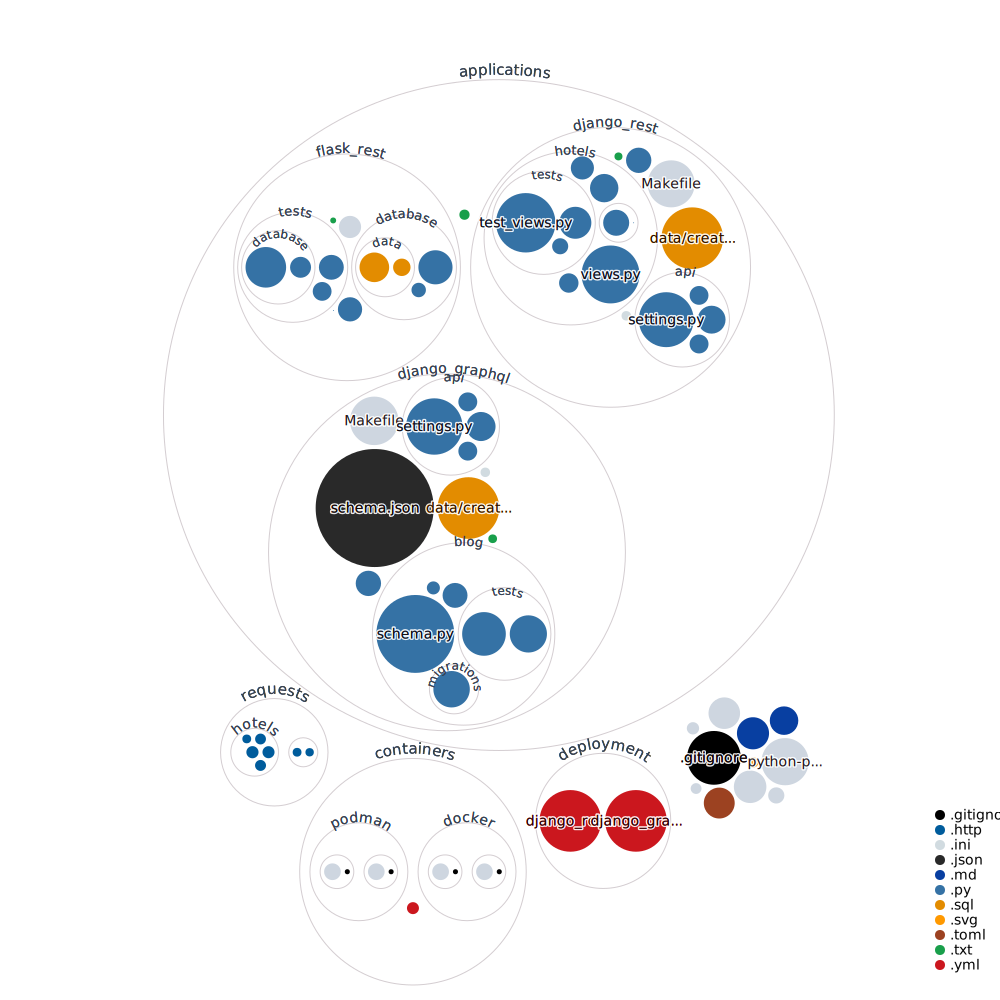

# Python Playground

My personal playground for Python experimentation

> [!WARNING]
> This project has been sunsetted and is no longer maintained. I've moved on to other projects and have built new projects in their own repositories.

## Table of Contents

- [Python Playground](#python-playground)
  - [Table of Contents](#table-of-contents)
  - [Quick Start](#quick-start)
  - [Projects](#projects)
    - [Hotels - Django REST API](#hotels---django-rest-api)
    - [Blog - Django GraphQL API](#blog---django-graphql-api)
    - [Flask - REST API](#flask---rest-api)
  - [Repository Visualisation](#repository-visualisation)

## Quick Start

From the root of the project, run the following commands:

```bash
  python3 -m venv applications/venv
  source applications/venv/bin/activate
  make development-install
```

## Projects

### Hotels - Django REST API

A simple Django REST API for managing hotels.

Location: `applications/django_rest`

### Blog - Django GraphQL API

A simple Django GraphQL API for managing blog posts.

Location: `applications/django_graphql`

### Flask - REST API

A simple Flask REST API for managing users.

Location: `applications/flask_rest`

## Repository Visualisation


